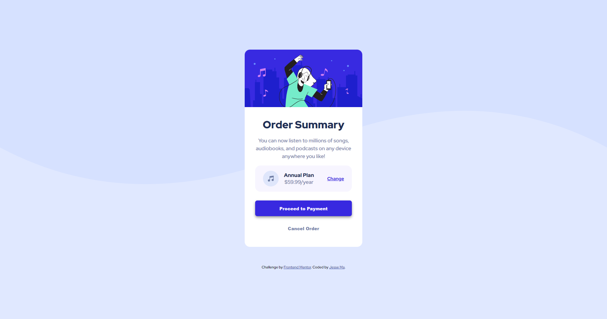

# Frontend Mentor - Order summary card solution

This is a solution to the [Order summary card challenge on Frontend Mentor](https://www.frontendmentor.io/challenges/order-summary-component-QlPmajDUj). Frontend Mentor challenges help you improve your coding skills by building realistic projects. 

## Table of contents

- [Overview](#overview)
  - [The challenge](#the-challenge)
  - [Screenshot](#screenshot)
  - [Links](#links)
- [My process](#my-process)
  - [Built with](#built-with)
  - [What I learned](#what-i-learned)

**Note: Delete this note and update the table of contents based on what sections you keep.**

## Overview

### The challenge

Users should be able to:

- See hover states for interactive elements

### Screenshot

## My process

### Links

- [Solution URL](https://github.com/jma26/Order-Summary-FE-Mentor-1)
- [Live Site URL](https://jma26.github.io/Order-Summary-FE-Mentor-1/)

### Built with

- HTML5
- CSS
- Flexbox

### What I learned

This challenge helped solidified my understanding of vanilla CSS (flexbox + css variables). If I were to continue working on it, I need to work on making the card fully responsive for desktop and mobile. At the moment, there isn't optimal breathing space around  the card on mobile screens and is not consistent on different screen sizes.

Next focus is to practice more on mobile-first designs and scaling it up to larger desktop screens